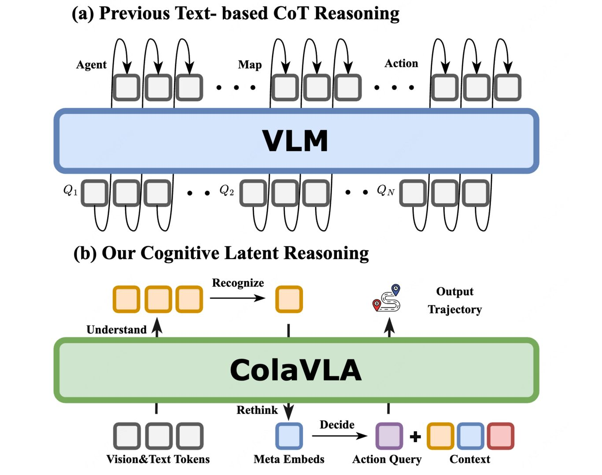
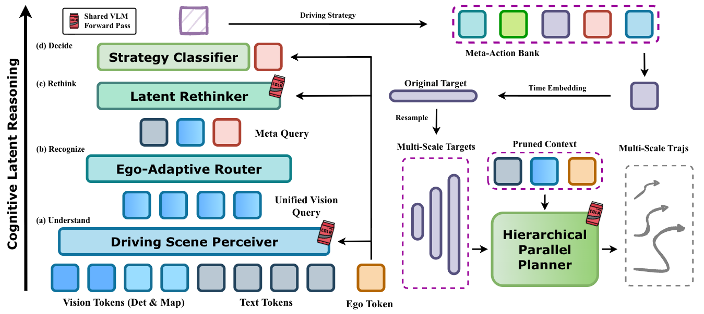
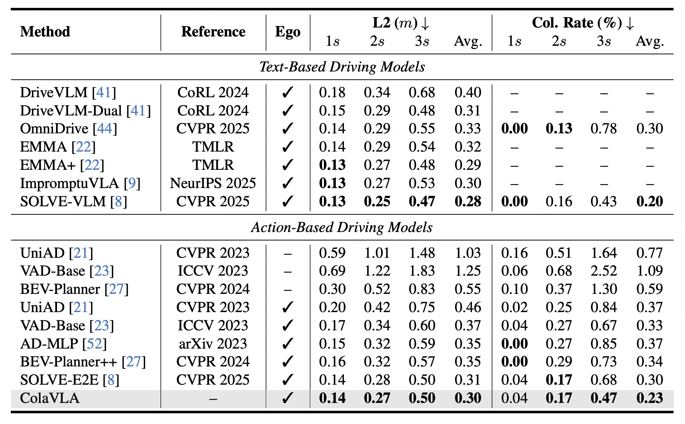
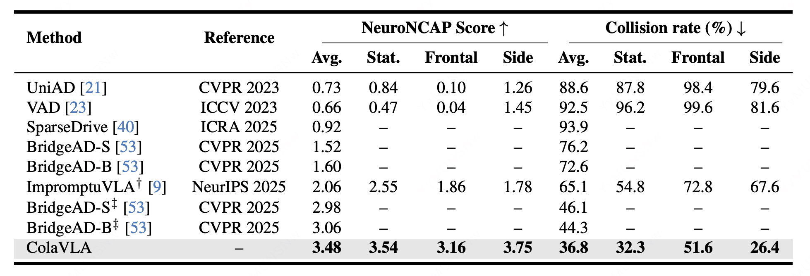
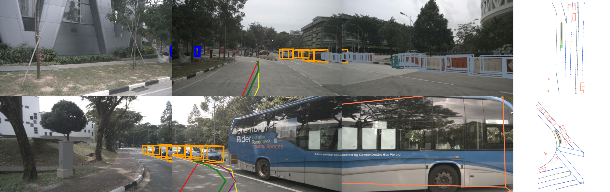

<br>
<p align="center">
  <h1 align="center"><strong>ColaVLA: Leveraging Cognitive Latent Reasoning for Hierarchical Parallel Trajectory Planning in Autonomous Driving</strong></h1>
  <h3 align="center">🔥 CVPR 2026 🔥 </h3>
  <p align="center">
    <a href="https://pqh22.github.io/" target="_blank">Qihang Peng</a><sup>1,2,3</sup>&emsp;
    <a href="https://scholar.google.com/citations?user=_XZonAsAAAAJ&hl=en" target="_blank">Xuesong Chen</a><sup>2,3</sup>&emsp;
    <a href="https://github.com/pfxnb" target="_blank">Chenye Yang</a><sup>1</sup>&emsp;
    <a href="https://shishaoshuai.com/" target="_blank">Shaoshuai Shi</a><sup>3</sup>&emsp;
    <a href="https://www.ee.cuhk.edu.hk/~hsli/" target="_blank">Hongsheng Li</a><sup>2</sup>
    <br>
    <sup>1</sup>Tsinghua University&nbsp;&nbsp;
    <sup>2</sup>CUHK MMLab&nbsp;&nbsp;
    <sup>3</sup>Voyager Research, Didi Chuxing
  </p>
</p>


<div id="top" align="center">

[](https://arxiv.org/abs/2512.22939)
[](https://arxiv.org/pdf/2512.22939)
[](https://pqh22.github.io/projects/ColaVLA/index.html)

</div>

---

## 🔥 News
- **[2026-03]** Training and evaluation scripts for ColaVLA are released ! We also open-source the code for [[CVPR2025] SOLVE: Synergy of Language-Vision and End-to-End Networks for Autonomous Driving](https://openaccess.thecvf.com/content/CVPR2025/papers/Chen_SOLVE_Synergy_of_Language-Vision_and_End-to-End_Networks_for_Autonomous_Driving_CVPR_2025_paper.pdf), an innovative framework
that synergizes VLMs with end-to-end models to enhance autonomous vehicle planning, along with the corresponding [configs](https://github.com/pqh22/ColaVLA/blob/main/projects/configs/solve_vlm_seq_384_cot_rag5_loade6qformere2e0320_noqa_headlr20_e10_cotspeed.py) and [models](https://github.com/pqh22/ColaVLA/blob/main/projects/mmdet3d_plugin/models/detectors/petr3d_image_seq_e2e_cot.py).
- **[2026-02]** Our paper was accept by CVPR2026 ! 🥳 
- **[2025-12]** We release the [paper](https://arxiv.org/pdf/2512.22939) and the [project page](https://pqh22.github.io/projects/ColaVLA/index.html) for **ColaVLA**.

---

## ⭐ Overview
**ColaVLA** is a unified vision–language–action framework for autonomous driving trajectory planning.
While VLMs provide strong priors and commonsense reasoning, VLM-based planners often suffer from:
1) mismatch between discrete text reasoning and continuous control,  
2) high latency from autoregressive chain-of-thought decoding, and  
3) non-causal or inefficient planning that hinders real-time deployment.

ColaVLA addresses these issues by **transferring reasoning from text to a compact latent space** and **decoding multi-scale trajectories in parallel**.

---

## ⭐ Motivation (Reasoning Paradigm)
<div align="center">
  
</div>

We propose **Cognitive Latent Reasoning** to relocate chain-of-thought from discrete text to a compact latent space,
reducing latency while preserving VLM generalization and interpretability.

---

## 📖 Framework
<div align="center">
  
</div>

ColaVLA consists of two key components:

- **Cognitive Latent Reasoner**: compresses multimodal scene understanding into compact, decision-oriented **meta-action embeddings** with ego-adaptive selection and only a small number of VLM passes.
- **Hierarchical Parallel Planner**: generates **multi-scale**, **causality-consistent** trajectories in a **single forward pass** with a hierarchical decoder and a hybrid attention mask.

---

## 📊 Results
<div align="center">
  
</div>

<div align="center">
  
</div>

We report strong performance on nuScenes in both **open-loop** and **closed-loop** evaluations, with favorable efficiency and robustness.
Please see the paper for full tables, metrics, and ablations.

---

## 👀 Visualization
<div align="center">
  
</div>

Qualitative examples show robust planning under complex multi-agent interactions and safety-critical scenarios.

---

## 📝 TODO
- \[x\] Release paper and project page.
- \[x\] Release training / evaluation code.
- \[ \] Release model checkpoints.
- \[ \] Provide detailed reproduction instructions.

---

## 📚 Getting Started
Coming soon...

---

## 📬 Contact
If you have questions about the paper, feel free to open an issue or contact:
- **Qihang Peng**: `pqh22@mails.tsinghua.edu.cn`

---

## 🔗 Citation
If you find our work helpful, please cite:

```bibtex
@misc{peng2025colavlaleveragingcognitivelatent,
      title={ColaVLA: Leveraging Cognitive Latent Reasoning for Hierarchical Parallel Trajectory Planning in Autonomous Driving}, 
      author={Qihang Peng and Xuesong Chen and Chenye Yang and Shaoshuai Shi and Hongsheng Li},
      year={2025},
      eprint={2512.22939},
      archivePrefix={arXiv},
      primaryClass={cs.CV},
      url={https://arxiv.org/abs/2512.22939}, 
}
